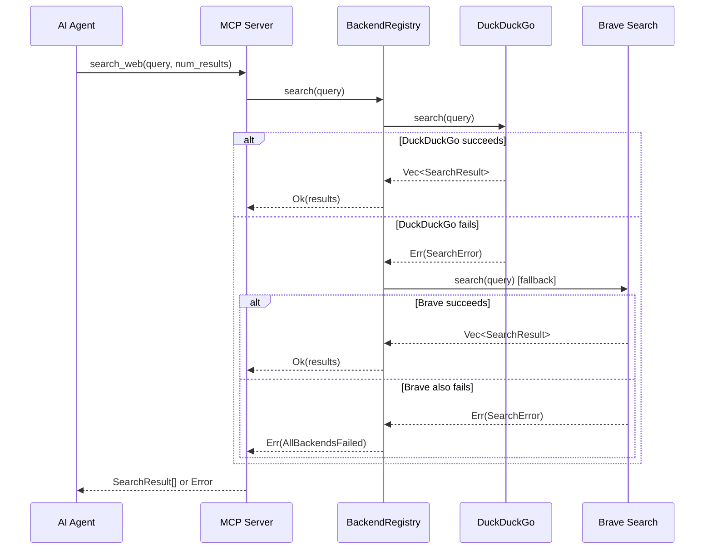
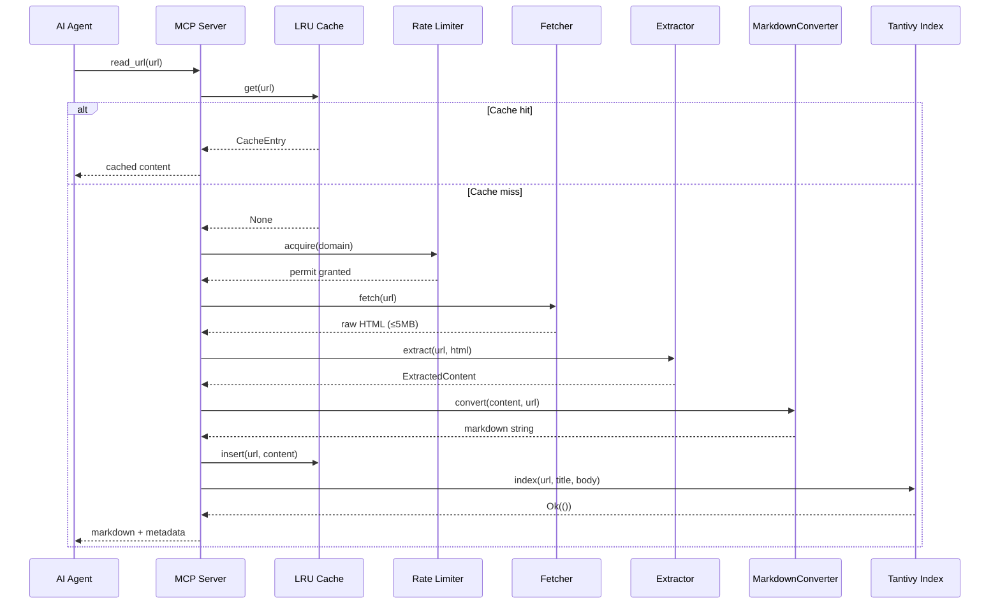
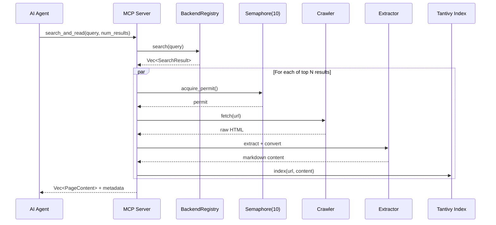
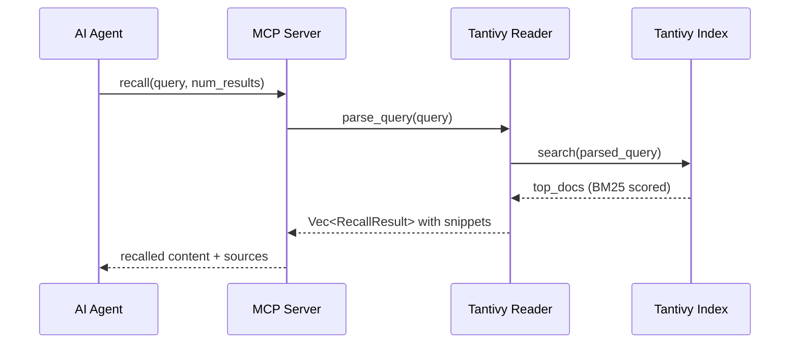
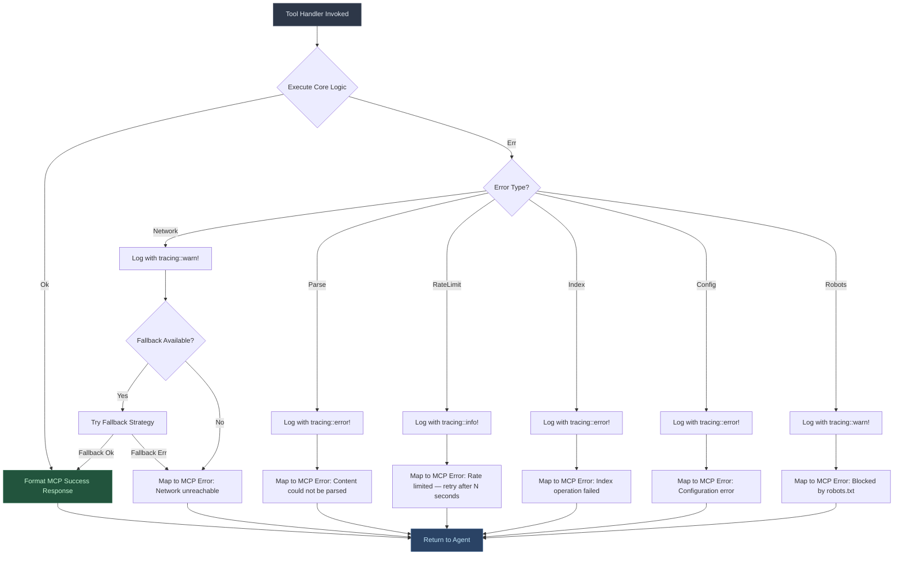
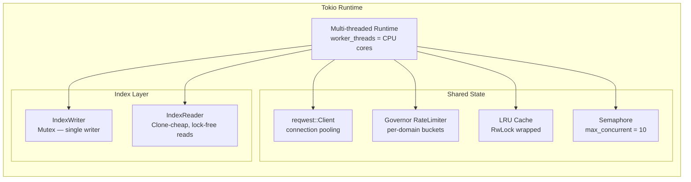
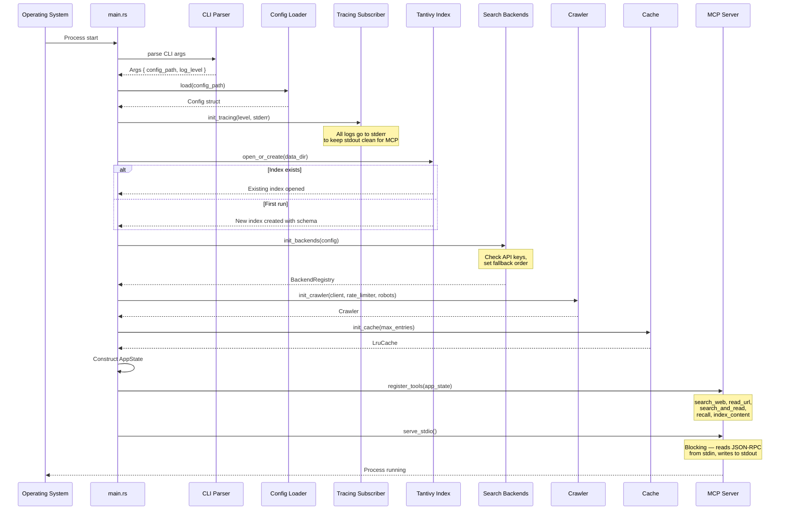
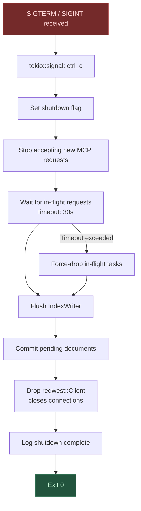
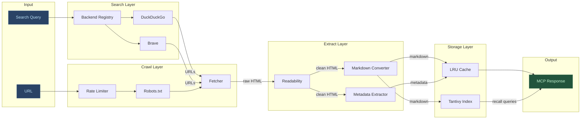
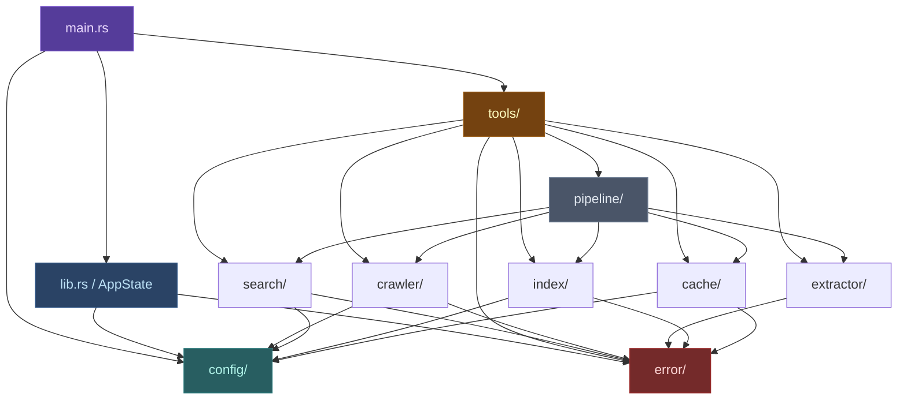

# Core Architecture — searchxyz

> **searchxyz** is an MCP-native research toolkit written in Rust.
> It provides search, crawl, extract, and index capabilities over stdio,
> designed for AI agent consumption.

---

## 1. Module Structure

```
searchxyz/
├── Cargo.toml                # Workspace manifest & dependency declarations
├── config.toml.example       # Annotated default configuration template
├── README.md                 # Project overview, usage, and quick-start
├── docs/                     # Architecture & design documentation
└── src/
    ├── main.rs               # Entry point — CLI parsing, init, MCP server start
    ├── lib.rs                # Re-exports, top-level AppState, shared types
    ├── config/
    │   ├── mod.rs            # Config struct definitions & loader
    │   └── defaults.rs       # Compile-time default values for every setting
    ├── error/
    │   ├── mod.rs            # Unified SearchXyzError enum
    │   └── handler.rs        # MCP error-response formatting & logging
    ├── search/
    │   ├── mod.rs            # SearchBackend trait & backend registry
    │   ├── duckduckgo.rs     # DuckDuckGo HTML-scrape backend
    │   ├── brave.rs          # Brave Search API backend
    │   └── types.rs          # SearchResult, SearchQuery, SearchResponse
    ├── crawler/
    │   ├── mod.rs            # Crawler orchestrator & public API
    │   ├── fetcher.rs        # HTTP fetching with retries & timeout
    │   ├── rate_limiter.rs   # Per-domain token-bucket (Governor)
    │   └── robots.rs         # robots.txt parser & cache
    ├── extractor/
    │   ├── mod.rs            # ContentExtractor trait & extractor registry
    │   ├── readability.rs    # Readability-based main content extraction
    │   ├── markdown.rs       # HTML → Markdown conversion (MarkdownConverter)
    │   └── metadata.rs       # Title, description, OG tags, favicon
    ├── index/
    │   ├── mod.rs            # Tantivy index manager — open, create, commit
    │   ├── schema.rs         # Tantivy schema definition (url, title, body, ts)
    │   ├── writer.rs         # Single-writer wrapper with commit batching
    │   └── reader.rs         # Query parser, searcher, snippet generation
    ├── cache/
    │   ├── mod.rs            # LRU content cache — get, insert, evict
    │   └── types.rs          # CacheEntry, CacheKey, CacheStats
    ├── tools/
    │   └── mod.rs            # MCP tool schemas, definitions, and handlers
    └── pipeline/
        ├── mod.rs            # Pipeline stage abstraction
        └── research.rs       # Multi-step research pipeline orchestrator
```

### Module Responsibilities

| Module | Responsibility |
|---|---|
| **`main.rs`** | Parses CLI arguments via `clap`, loads configuration, initializes the tracing subscriber (always to stderr), constructs `AppState`, registers MCP tools, and starts the MCP stdio server. |
| **`lib.rs`** | Defines `AppState` (the shared application context holding all subsystem handles), re-exports public types, and provides the crate-level documentation. |
| **`config/`** | Loads and validates `config.toml` with layered precedence: defaults → file → env vars → CLI flags. `defaults.rs` contains every default as a `const` so they are available at compile time and documented in one place. |
| **`error/`** | Defines `SearchXyzError` — a single enum covering every failure mode (network, parse, index, config, rate-limit, cache, robots). `handler.rs` maps each variant to an MCP-compatible error response with an actionable message the calling agent can understand. |
| **`search/`** | Houses the `SearchBackend` trait and concrete implementations. `mod.rs` exposes a `BackendRegistry` that holds all available backends and implements the fallback chain. `types.rs` defines the shared `SearchResult` struct used across backends. |
| **`crawler/`** | Manages HTTP fetching with configurable concurrency. `fetcher.rs` wraps `reqwest::Client` with retry logic, response-size limits (5 MB), and timeout enforcement. `rate_limiter.rs` provides a per-domain Governor rate limiter. `robots.rs` fetches, parses, and caches `robots.txt` to respect crawl directives. |
| **`extractor/`** | Transforms raw HTML into clean, structured content. `readability.rs` implements a readability algorithm to extract the main article body. `markdown.rs` converts cleaned HTML into Markdown via the `MarkdownConverter` trait. `metadata.rs` extracts title, description, Open Graph tags, and favicons. |
| **`index/`** | Wraps Tantivy for full-text indexing and search. `schema.rs` defines the index schema. `writer.rs` enforces the single-writer pattern with batched commits. `reader.rs` provides query parsing, BM25 scoring, and snippet highlighting. |
| **`cache/`** | In-memory LRU cache for extracted page content, keyed by URL. Configurable max entries and TTL. `types.rs` defines `CacheEntry` with content, metadata, and insertion timestamp. |
| **`tools/`** | Exposes the `SearchXyzServer` struct. `mod.rs` contains all MCP tool request schemas and async handlers (including GitHub ingestion and research sharing endpoints) defined using the `#[tool]` macro. |
| **`pipeline/`** | Orchestrates multi-step workflows. `research.rs` chains search → crawl → extract → index into a single pipeline with configurable parallelism and early termination on sufficient results. |

---

## 2. Core Traits

### `SearchBackend`

```rust
/// A pluggable web search backend.
///
/// Implementors provide keyword search against a specific search engine.
/// Each backend declares its own availability (e.g., API key present)
/// so the registry can skip unavailable backends in the fallback chain.
#[async_trait]
pub trait SearchBackend: Send + Sync {
    /// Human-readable name for logging and tool descriptions.
    /// Example: `"DuckDuckGo"`, `"Brave Search"`
    fn name(&self) -> &'static str;

    /// Returns `true` if this backend is configured and ready.
    /// Checked once at startup and used to build the fallback order.
    fn is_available(&self) -> bool;

    /// Execute a search query and return a list of results.
    ///
    /// # Errors
    /// Returns `SearchXyzError::Search` on network failure,
    /// parse failure, or rate-limit exhaustion.
    async fn search(
        &self,
        query: &SearchQuery,
    ) -> Result<Vec<SearchResult>, SearchXyzError>;
}
```

### `ContentExtractor`

```rust
/// Extracts the main readable content from raw HTML.
///
/// Implementations may use heuristic algorithms (readability),
/// CSS selectors, or hybrid approaches. The extractor returns
/// cleaned HTML suitable for downstream markdown conversion.
pub trait ContentExtractor: Send + Sync {
    /// Identifier for this extractor strategy.
    fn name(&self) -> &'static str;

    /// Extract main content from `raw_html`.
    ///
    /// - `url`: The source URL, used for resolving relative links.
    /// - `raw_html`: The full HTML document as a string.
    ///
    /// # Returns
    /// `ExtractedContent` containing cleaned HTML, metadata, and
    /// word count. Returns `SearchXyzError::Extract` on failure.
    fn extract(
        &self,
        url: &str,
        raw_html: &str,
    ) -> Result<ExtractedContent, SearchXyzError>;
}
```

### `MarkdownConverter`

```rust
/// Converts cleaned HTML into Markdown.
///
/// Operates on already-extracted content (not raw pages).
/// Preserves structure: headings, lists, code blocks, links, images.
pub trait MarkdownConverter: Send + Sync {
    /// Convert an HTML fragment into Markdown text.
    ///
    /// # Arguments
    /// - `html`: Cleaned HTML from a `ContentExtractor`.
    /// - `base_url`: Base URL for resolving relative links.
    ///
    /// # Returns
    /// A Markdown string. Never fails — malformed HTML degrades
    /// gracefully to plain text.
    fn convert(
        &self,
        html: &str,
        base_url: &str,
    ) -> String;
}
```

---

## 3. Request Flow Diagrams

### `search_web`



### `read_url`



### `search_and_read`



### `recall`



---

## 4. Error Handling Architecture



### Error Design Principles

| Principle | Implementation |
|---|---|
| **Never panic** | All functions return `Result<T, SearchXyzError>`. No `.unwrap()` in production paths. |
| **Actionable messages** | Every error variant maps to a human-readable message an AI agent can act on. |
| **Fallback-first** | Network and search errors trigger fallback chains before surfacing an error. |
| **Structured logging** | All errors pass through `tracing` with structured fields (`url`, `backend`, `status_code`). |
| **Error context** | Uses `.context()` (via `anyhow` or manual impl) to attach call-site information. |

---

## 5. Concurrency Architecture



### Concurrency Primitives

| Component | Primitive | Rationale |
|---|---|---|
| **Tokio runtime** | `tokio::runtime::Builder::new_multi_thread()` | Maximize throughput on multi-core systems. |
| **Rate limiter** | `governor::RateLimiter` with `DashMap<domain, limiter>` | Non-blocking, per-domain token bucket. Default: 2 req/s/domain. |
| **HTTP client** | `reqwest::Client` (shared via `Arc`) | Connection pooling, keep-alive, automatic redirect. |
| **Tantivy writer** | `Mutex<IndexWriter>` | Tantivy requires a single writer. Mutex serializes commits. |
| **Tantivy reader** | `IndexReader` (cloned per task) | Readers are lock-free and cheap to clone. |
| **Crawl concurrency** | `tokio::sync::Semaphore(10)` | Caps total in-flight fetches to prevent resource exhaustion. |
| **Cache** | `tokio::sync::RwLock<LruCache>` | Many concurrent reads, infrequent writes. |
| **Pipeline channels** | `tokio::sync::mpsc::channel(bounded)` | Backpressure between pipeline stages. |

---

## 6. Memory Management Strategy

| Strategy | Detail |
|---|---|
| **Avoid hot-path allocations** | Pre-allocate buffers for HTML parsing. Reuse `String` buffers where possible. Use `&str` references through extraction pipelines. |
| **Memory-mapped index** | Tantivy `MmapDirectory` — the OS manages page faults; the index can exceed physical RAM. |
| **LRU cache bounds** | Configurable `max_entries` (default: 500). Entries evicted in LRU order. Each entry stores markdown (not raw HTML). |
| **Streaming parsing** | HTTP responses streamed via `response.chunk()`. HTML parsed incrementally where the parser supports it. |
| **Drop raw HTML early** | Raw HTML is dropped immediately after extraction. Only the cleaned markdown and metadata are retained. |
| **Response size limit** | Responses exceeding 5 MB are aborted at the `reqwest` layer via `content_length()` check and streaming byte counter. |
| **String interning** | Domain strings and common field names interned to reduce repeated allocations. |

```
┌──────────────────────────────────────────────────────┐
│                   Memory Layout                       │
├──────────────────────────────────────────────────────┤
│  Stack                                                │
│  ├── Tool handler frames                              │
│  └── Extractor temporary buffers                      │
├──────────────────────────────────────────────────────┤
│  Heap (bounded)                                       │
│  ├── LRU Cache (≤500 entries × ~50KB avg = ~25MB)     │
│  ├── reqwest connection pool (~2MB)                    │
│  ├── Rate limiter state (~1KB per domain)             │
│  └── Search result buffers (transient)                │
├──────────────────────────────────────────────────────┤
│  Memory-Mapped (OS managed)                           │
│  └── Tantivy index segments (grows with content)      │
└──────────────────────────────────────────────────────┘
```

---

## 7. Startup & Initialization Sequence



### Startup Invariants

> [!IMPORTANT]
> These invariants are enforced at startup. If any fail, the process exits with a
> descriptive error on stderr and a non-zero exit code.

1. **Config is valid** — all required fields present, values within bounds.
2. **Data directory is writable** — Tantivy needs write access for index segments.
3. **At least one search backend is available** — at minimum, DuckDuckGo (no API key required).
4. **Tracing is on stderr** — stdout is reserved exclusively for MCP JSON-RPC.

---

## 8. Graceful Shutdown



### Shutdown Sequence Detail

| Step | Action | Failure Mode |
|---|---|---|
| 1 | Catch `SIGTERM` / `SIGINT` via `tokio::signal` | — |
| 2 | Set `AtomicBool` shutdown flag | — |
| 3 | MCP server stops reading new requests from stdin | — |
| 4 | Await in-flight tasks with 30s timeout | Timeout → force cancel |
| 5 | `IndexWriter::commit()` flushes buffered documents | Log error, continue shutdown |
| 6 | Drop `reqwest::Client` (closes TCP connections) | — |
| 7 | `tracing::info!("shutdown complete")` | — |
| 8 | `std::process::exit(0)` | — |

> [!NOTE]
> The Tantivy `IndexWriter::commit()` is the most critical shutdown step.
> Un-committed documents are lost. The writer is flushed before any
> connection teardown to minimize data loss.

---

## 9. Data Flow Architecture



### Data Transformations

```
Search Query
  │
  ▼
SearchResult { title, url, snippet }     ← search backends
  │
  ▼
Raw HTML (≤5MB)                          ← fetcher
  │
  ▼
ExtractedContent {                       ← readability extractor
    clean_html: String,
    word_count: usize,
}
  │
  ├──▶ Metadata { title, description,   ← metadata extractor
  │       og_image, favicon }
  │
  ▼
Markdown String                          ← markdown converter
  │
  ├──▶ LRU Cache (keyed by URL)
  │
  ▼
Tantivy Document {                       ← index writer
    url: String,
    title: String,
    body: String,       // markdown
    timestamp: DateTime,
}
  │
  ▼
MCP Tool Response (JSON)                 ← tool handler
```

---

## 10. Dependency Graph



### Dependency Rules

> [!IMPORTANT]
> These rules prevent circular dependencies and keep the architecture clean.

| Rule | Enforcement |
|---|---|
| `error/` depends on **nothing** (leaf module) | No `use crate::` imports except std |
| `config/` depends only on `error/` | Validated at review time |
| `search/`, `crawler/`, `extractor/`, `index/`, `cache/` depend on `config/` and `error/` | Each module is independently testable |
| `tools/` depends on all domain modules | Tools are thin orchestration wrappers |
| `pipeline/` depends on domain modules but **not** `tools/` | Pipelines are reusable outside MCP context |
| `main.rs` depends on `tools/` and `config/` | Entry point wires everything together |
| **No circular dependencies** | Enforced by Rust's module system |

### External Crate Dependencies

| Crate | Purpose | Module(s) |
|---|---|---|
| `tokio` | Async runtime, channels, signals, semaphore | All |
| `reqwest` | HTTP client | `crawler/` |
| `tantivy` | Full-text search index | `index/` |
| `governor` | Rate limiting | `crawler/` |
| `clap` | CLI argument parsing | `main.rs` |
| `serde` / `toml` | Config deserialization | `config/` |
| `tracing` / `tracing-subscriber` | Structured logging | All |
| `scraper` | HTML parsing & CSS selectors | `extractor/` |
| `lru` | LRU cache implementation | `cache/` |
| `url` | URL parsing & normalization | `crawler/`, `extractor/` |
| `rmcp` | MCP protocol server (Rust MCP SDK) | `tools/`, `main.rs` |
| `thiserror` | Derive `Error` for enum variants | `error/` |
| `async-trait` | Async trait support | `search/`, `extractor/` |

---

## Summary

searchxyz is structured as a layered, modular system:

1. **Tools** sit at the top, providing the MCP interface.
2. **Pipeline** orchestrates multi-step workflows across domain modules.
3. **Domain modules** (`search`, `crawler`, `extractor`, `index`, `cache`) each own a single responsibility.
4. **Config** and **Error** are shared leaf modules with no upward dependencies.

Every async operation runs on the Tokio multi-threaded runtime. Concurrency is bounded
by semaphores and rate limiters. The Tantivy index uses memory-mapped files for efficient
disk I/O. All errors are caught, logged, and surfaced as actionable MCP messages — the
system never panics in production paths.
