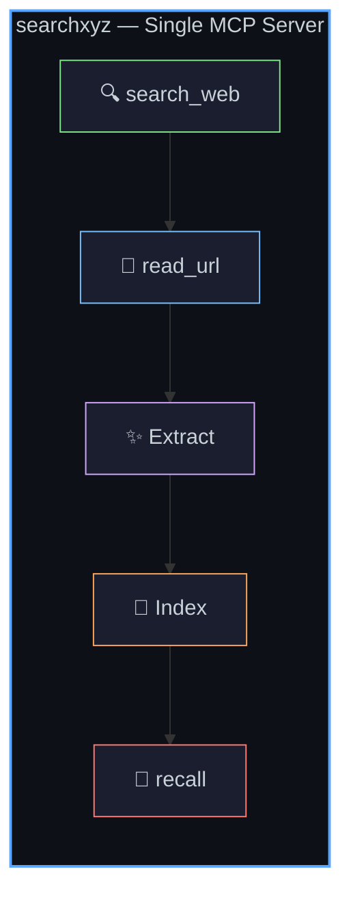
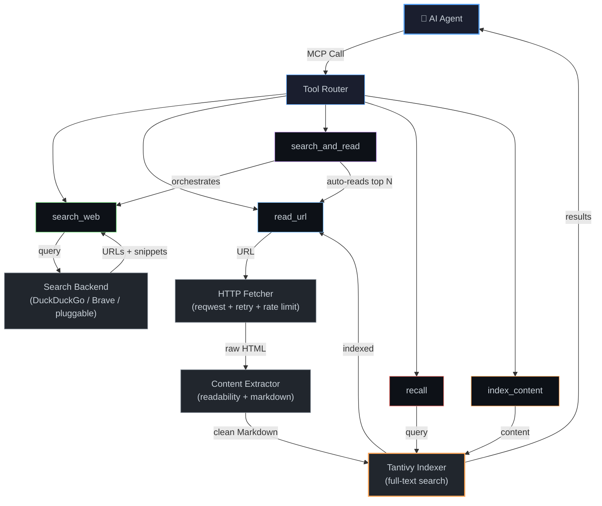
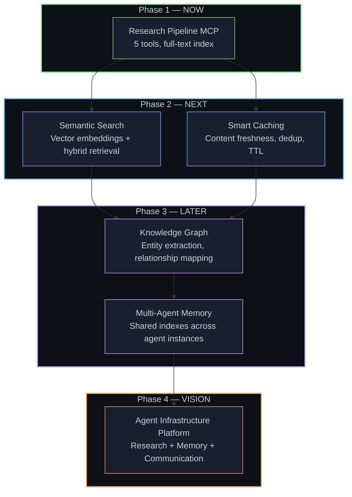

# searchxyz — The Research Pipeline for AI Agents

> **One MCP. Search. Read. Remember.**

---

## 1. The Problem

AI agents are drowning in tool fragmentation.

To do something as simple as *researching a topic*, today's agents need to juggle **5–10 separate MCP servers**, each with its own quirks:

| Tool | What it does | What it doesn't do |
|------|-------------|-------------------|
| **DuckDuckGo MCP** | Free web search | No crawling, no extraction, no memory |
| **Exa** | Neural search | Requires API key, no local index, expensive at scale |
| **Firecrawl** | Web crawling & extraction | No search, no recall, paid API |
| **Playwright MCP** | Browser automation | Overkill for content extraction, heavy resource usage |
| **Tavily** | AI-optimized search | Paid, no local indexing, vendor lock-in |
| **Brave Search** | Privacy-focused search | No crawling, no extraction, API-only |

### The real cost isn't money — it's complexity.

Every additional MCP means:

- **Another auth mechanism** to configure (API keys, OAuth, tokens)
- **Another rate limit** to respect (and crash into)
- **Another data format** to parse (JSON shapes vary wildly)
- **Another failure mode** to handle (timeouts, 429s, schema changes)
- **Another set of tokens** wasted on tool selection, parameter formatting, and error recovery

An agent doing research today spends more tokens *managing tools* than *doing research*.

### The performance problem nobody talks about

Most MCP servers are built in Python or Node.js. For a human developer, that's fine. For an AI agent making rapid-fire tool calls, it's a disaster:

- **Python MCPs**: 150–300MB RAM, GC pauses of 50–200ms, cold start times of 2–5 seconds
- **Node.js MCPs**: 100–200MB RAM, event loop blocking on heavy HTML parsing, unpredictable latency spikes
- **Agent timeouts**: MCP protocol has strict response windows — a GC pause at the wrong moment means a dropped tool call, wasted tokens, and a confused agent

The infrastructure is fighting against the agent, not for it.

---

## 2. The Insight

Strip away the tool names, the APIs, the SDKs. What does an AI agent actually *do* when it researches?

Three things:

```
Find → Read → Remember
```

That's it. Every research workflow reduces to:

1. **Find** relevant sources (search the web)
2. **Read** those sources (fetch and extract clean content)
3. **Remember** what was found (store for later recall)

Today, this requires 3–5 separate tool calls across 3–5 separate MCPs, burning 500–2000 tokens just on tool orchestration.

**The insight**: agents don't need ten separate tools — they need **one research pipeline** that handles the entire `Find → Read → Remember` loop in a single, composable interface.

And that pipeline needs to be *fast*. Not "fast for a web service" fast. Fast like "the agent barely notices it happened" fast.

That means Rust.

---

## 3. What is searchxyz?

**searchxyz** is a single, high-performance Rust MCP server that unifies the entire research pipeline into five composable tools:

| Tool | Purpose | What it replaces |
|------|---------|-----------------|
| `search_web` | Multi-source web search | DuckDuckGo, Brave, Exa, Tavily |
| `read_url` | Fetch & extract clean Markdown from any URL | Firecrawl, Playwright, fetch MCPs |
| `search_and_read` | Atomic search → read pipeline | Manual multi-tool orchestration |
| `recall` | Query previously indexed content | Custom RAG setups, vector DBs |
| `index_content` | Manually index any content | Note-taking MCPs, memory tools |

### The Pipeline



### How it works under the hood



### The `search_and_read` superpower

The killer tool is `search_and_read`. Instead of the agent making 4 separate calls:

```
Agent → search_web("rust async patterns")       → 5 URLs
Agent → read_url(url1)                           → content1
Agent → read_url(url2)                           → content2
Agent → read_url(url3)                           → content3
```

It makes **one call**:

```
Agent → search_and_read("rust async patterns", top_k=3) → [content1, content2, content3]
```

**One tool call. One round trip. All content extracted, cleaned, and indexed automatically.**

The agent saves ~800 tokens of tool orchestration and gets results 3–5x faster.

---

## 4. Why This Matters for AI Agents

### Fewer tool calls = fewer tokens = faster responses

Every tool call costs tokens — for the tool schema, the arguments, the response parsing. With searchxyz, a research workflow that took 5–8 tool calls across multiple MCPs becomes **1–2 calls** to a single server.

### Clean Markdown = better LLM comprehension

Raw HTML is noise. LLMs struggle with `<div class="article-wrapper"><section id="main">` soup. searchxyz's extraction pipeline produces clean, structured Markdown that LLMs can immediately reason over — no preprocessing, no token waste on HTML artifacts.

### Local index = instant recall

Every piece of content searchxyz reads gets automatically indexed in a local [Tantivy](https://github.com/quickwit-oss/tantivy) full-text search index. When the agent needs to reference something it read 20 minutes ago (or 20 days ago), it queries `recall` instead of re-crawling the web. Sub-millisecond local lookups instead of 2–5 second web round trips.

### One config, one binary, one MCP

No dependency hell. No `pip install` chains. No `node_modules` black holes. One Rust binary. Drop it in your MCP config and go.

```json
{
  "mcpServers": {
    "searchxyz": {
      "command": "searchxyz",
      "args": ["--index-dir", "~/.searchxyz"]
    }
  }
}
```

That's the entire setup. Compare that to configuring Exa + Firecrawl + DuckDuckGo + a vector DB.

---

## 5. Competitive Landscape & Gap Analysis

| Capability | DuckDuckGo | Exa | Firecrawl | Tavily | Brave Search | **searchxyz** |
|-----------|:----------:|:---:|:---------:|:------:|:------------:|:------------:|
| **🔍 Search** | ✅ | ✅ | ❌ | ✅ | ✅ | ✅ |
| **🕷️ Crawl** | ❌ | ❌ | ✅ | ❌ | ❌ | ✅ |
| **✨ Extract** | ❌ | Partial | ✅ | Partial | ❌ | ✅ |
| **💾 Index** | ❌ | ❌ | ❌ | ❌ | ❌ | ✅ |
| **🧠 Recall** | ❌ | ❌ | ❌ | ❌ | ❌ | ✅ |
| **🆓 Free tier** | ✅ | ❌ | ❌ | Limited | Limited | ✅ |
| **⚡ Rust/Fast** | ❌ | ❌ | ❌ | ❌ | ❌ | ✅ |
| **📦 Single MCP** | Search only | Search only | Crawl only | Search only | Search only | **Full pipeline** |

### The gap is clear.

No existing tool covers the full research pipeline. Every alternative forces agents into multi-tool orchestration. searchxyz is the first MCP that says: *"Give me a query. I'll find it, read it, clean it, store it, and give it back to you — all in one call."*

---

## 6. Why Rust?

This isn't Rust for Rust's sake. The MCP protocol has specific constraints that make language choice a *correctness* issue, not a preference.

### The MCP Latency Problem

MCP servers communicate over stdio or HTTP with strict timeout expectations. When an AI agent calls a tool, it expects a response within a predictable window. A GC pause at the wrong moment doesn't just slow things down — it **drops the tool call entirely**, wasting tokens and breaking the agent's reasoning chain.

### Rust solves this structurally

| Property | Rust | Node.js | Python |
|----------|------|---------|--------|
| **Idle RAM** | ~40MB | ~100MB | ~150MB |
| **Under load RAM** | ~80MB | ~250MB | ~400MB |
| **P99 latency** | Predictable | GC spikes | GC spikes |
| **Cold start** | <100ms | ~500ms | ~2s |
| **Concurrency model** | Tokio async (M:N) | Single-threaded event loop | GIL-limited |
| **Binary size** | ~15MB static | `node_modules` 🫠 | `venv` 🫠 |
| **Deployment** | Single binary | Runtime + deps | Runtime + deps |

### Specific Rust advantages for searchxyz

- **Zero-cost abstractions**: The readability extraction pipeline processes HTML through multiple transformation passes. In Rust, these compose with zero overhead — no boxing, no dynamic dispatch, no allocation churn.

- **Tokio async runtime**: Crawling 10 pages concurrently? Tokio handles thousands of concurrent connections on a single thread pool. No callback hell, no promise chains, just `async`/`await` with real parallelism.

- **Memory-mapped Tantivy indexes**: The local search index uses memory-mapped files. The OS manages the page cache. Rust's ownership model guarantees no dangling references, no use-after-free, no data races on the index.

- **Single static binary**: `cargo build --release` produces one binary. Copy it anywhere. No runtime, no interpreter, no dependency resolution at deploy time.

- **Predictable performance**: No garbage collector means no latency surprises. The agent gets consistent, sub-second responses every time.

---

## 7. The Wedge: Research Pipeline

> *"Start narrow. Nail the wedge. Expand from strength."*

searchxyz doesn't try to be everything on day one. The **MVP is a research pipeline MCP** with exactly five tools:


### Why these five?

| Tool | Why it's in the MVP |
|------|-------------------|
| `search_web` | Every research workflow starts with search. This is table stakes. |
| `read_url` | Agents constantly need to read web pages. Current options are slow or require separate MCPs. |
| `search_and_read` | The **compound tool** — this is the wedge. No other MCP offers atomic search-to-content. |
| `recall` | This is the **retention moat**. Once content is indexed, agents come back. Switching cost increases with every query. |
| `index_content` | Lets agents store *any* content — not just web pages. Meeting notes, code snippets, research summaries. |

### What's explicitly NOT in the MVP

- Semantic/vector search (requires embedding models — adds complexity)
- Knowledge graphs (fascinating but premature)
- Multi-agent coordination (needs the single-agent story to be perfect first)
- Browser automation (Playwright exists; don't compete, complement)

---

## 8. Long-Term Vision

The research pipeline is the seed. Here's what it grows into:



### Phase 2: Semantic Search & Smart Caching

- **Vector embeddings**: Integrate local embedding models (ONNX Runtime) for semantic similarity search alongside full-text. Hybrid retrieval that combines keyword precision with semantic understanding.
- **Smart caching**: Content freshness detection, deduplication, configurable TTL. Don't re-crawl what hasn't changed.

### Phase 3: Knowledge Graph & Multi-Agent Memory

- **Knowledge graph**: Automatic entity extraction from indexed content. Build a local knowledge graph that agents can traverse — "What companies are mentioned in my research about quantum computing?"
- **Multi-agent memory**: Shared Tantivy indexes across agent instances. Agent A researches a topic; Agent B can recall those findings instantly. Collaborative intelligence without a centralized server.

### Phase 4: Agent Infrastructure Platform

The endgame isn't a search tool. It's an **agent infrastructure layer** — the runtime substrate that makes agents smarter, faster, and more capable:

- **Research**: Find and synthesize information (Phase 1)
- **Memory**: Remember and recall across sessions (Phase 2–3)
- **Understanding**: Connect concepts and entities (Phase 3)
- **Collaboration**: Share knowledge across agent instances (Phase 3–4)

searchxyz starts as a tool agents use. It becomes the platform agents think with.

---

## 9. Design Philosophy

Five principles. Non-negotiable.

### ⚡ Fast

| Operation | Target | Why |
|-----------|--------|-----|
| Local recall query | <10ms | Agents should feel like the index is in-memory |
| Content extraction | <500ms | Parsing HTML shouldn't be the bottleneck |
| Search + read pipeline | <5s | End-to-end, including network round trips |
| Cold start | <100ms | MCP servers start on first tool call — this must be instant |

### 🪶 Low RAM

| State | Target | How |
|-------|--------|-----|
| Idle | <50MB | Lazy initialization — don't load what isn't needed |
| Under load | <100MB | Streaming HTML parsing, bounded buffers, no full-document copies |
| Index size | ~1MB per 1000 pages | Tantivy's compressed inverted index is remarkably space-efficient |

### 📦 Efficient

- **Single binary**: No runtime dependencies, no package managers, no container orchestration
- **Minimal disk**: Memory-mapped indexes, compressed storage, lazy loading
- **Zero-copy where possible**: Rust's borrowing enables processing without allocation

### 🛡️ Resilient

```
                    ┌─────────────────────────────────┐
                    │        Resilience Stack          │
                    ├─────────────────────────────────┤
                    │  Retry with exponential backoff  │
                    │  ↓                               │
                    │  Fallback search backends        │
                    │  ↓                               │
                    │  Rate limit awareness            │
                    │  ↓                               │
                    │  Graceful degradation             │
                    │  ↓                               │
                    │  Structured error responses       │
                    └─────────────────────────────────┘
```

Every failure mode has a recovery path. Rate limited? Back off and retry. Search backend down? Fall through to the next one. Extraction failed? Return raw content with a warning. Network timeout? Return cached version if available.

### 🤖 Agent-Native

This is the most important principle. searchxyz is built *for agents*, not adapted for them.

**Error messages are interfaces.**

Bad (generic, useless to an agent):
```
Error: Request failed
```

Good (actionable, the agent knows what to do next):
```json
{
  "error": "rate_limited",
  "retry_after_seconds": 30,
  "suggestion": "Use 'recall' to check if this content was previously indexed",
  "cached_result_available": true
}
```

Every response is designed to help the agent make its *next* decision. Errors aren't failures — they're navigation signals.

---

## 10. Name & Identity

### searchxyz

Simple. Memorable. Extensible.

- **search** — the core verb, the primary action
- **xyz** — the unknown variables, the things you're searching *for*. Also a nod to mathematical completeness — search across all dimensions.

### Tagline

> ***"The research pipeline for AI agents."***

Not a search API. Not a web scraper. Not a database.

A *research pipeline* — the complete system that takes a question and returns understanding.

### Identity markers

- **One MCP, five tools, zero compromises**
- **Find → Read → Remember**
- **Built in Rust for agents that can't wait**

---

## Summary

searchxyz exists because AI agents deserve better infrastructure.

Today's agents are brilliant reasoners trapped in a slow, fragmented toolchain. They spend more tokens managing tools than using them. They lose context because nothing remembers. They timeout because their infrastructure wasn't built for their speed.

searchxyz fixes this with a simple bet: **one fast, well-designed research pipeline is worth more than ten mediocre tools stitched together.**

```
┌──────────────────────────────────────────────┐
│                                              │
│   Query ──→ Search ──→ Read ──→ Remember     │
│                                              │
│   One binary. One MCP. Sub-second recall.    │
│                                              │
│   searchxyz — The research pipeline          │
│                for AI agents.                │
│                                              │
└──────────────────────────────────────────────┘
```

---

*This document is a living artifact. It captures the vision as of the project's inception and will evolve as searchxyz grows from a research pipeline into an agent infrastructure platform.*
