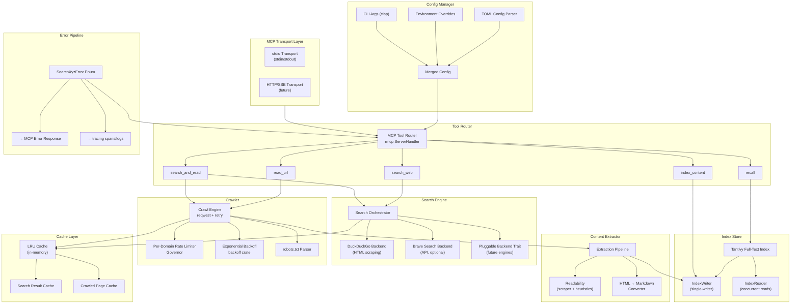

# searchxyz — Technical Specification

> **Version:** 0.1.0  
> **Status:** Implementation-Ready Draft  
> **Last Updated:** 2026-06-21  
> **Runtime:** Rust (2021 edition) + Tokio async

---

## 1. System Architecture



### Component Responsibilities

| Component | Responsibility |
|---|---|
| **Transport Layer** | Accepts MCP JSON-RPC over stdio (primary) or HTTP/SSE (future). Handled by `rmcp`. |
| **Tool Router** | Dispatches incoming `tools/call` requests to the correct handler. Implements `rmcp::ServerHandler`. |
| **Search Engine** | Orchestrates web search across multiple backends with fallback. Returns ranked `SearchResult` vectors. |
| **Crawler** | Fetches raw HTML from URLs with retry, rate limiting, and robots.txt compliance. |
| **Content Extractor** | Converts raw HTML into clean, readable Markdown. Strips boilerplate, ads, navigation. |
| **Index Store** | Persists extracted content in a Tantivy full-text search index for later recall. |
| **Cache Layer** | In-memory LRU caches for search results and crawled pages to reduce redundant network calls. |
| **Config Manager** | Merges TOML file + env vars + CLI args into a unified, validated `Config` struct. |
| **Error Pipeline** | Typed error enum with structured conversion to MCP error responses and tracing integration. |

---

## 2. Crate Dependencies

```toml
[package]
name = "searchxyz"
version = "0.1.0"
edition = "2021"
rust-version = "1.80"
description = "High-performance MCP server for AI agent web research"
license = "MIT"

[dependencies]
# MCP protocol
rmcp = { version = "0.16", features = ["server", "transport-io"] }

# Async runtime
tokio = { version = "1", features = ["full"] }

# HTTP client
reqwest = { version = "0.12", default-features = false, features = [
    "rustls-tls", "json", "gzip", "brotli", "deflate", "cookies"
] }

# Serialization
serde = { version = "1.0", features = ["derive"] }
serde_json = "1.0"

# Full-text search index
tantivy = "0.22"

# Error handling
thiserror = "2.0"
anyhow = "1.0"

# Observability
tracing = "0.1"
tracing-subscriber = { version = "0.3", features = ["env-filter", "json"] }

# Retry with exponential backoff
backoff = { version = "0.4", features = ["tokio"] }

# Rate limiting
governor = "0.8"

# URL parsing & validation
url = "2.5"

# HTML parsing & CSS selectors
scraper = "0.22"

# In-memory LRU cache
lru = "0.12"

# Config file parsing
toml = "0.8"

# CLI argument parsing
clap = { version = "4", features = ["derive", "env"] }

# Date/time
chrono = { version = "0.4", features = ["serde"] }

# Unique identifiers
uuid = { version = "1", features = ["v4"] }

# Async trait support
async-trait = "0.1"

[dev-dependencies]
wiremock = "0.6"
tokio-test = "0.4"
criterion = { version = "0.5", features = ["async_tokio"] }
tempfile = "3.15"
assert_matches = "1.5"

[[bench]]
name = "search_bench"
harness = false
```

### Dependency Rationale

| Crate | Why |
|---|---|
| `rmcp` | First-class Rust MCP SDK. Handles JSON-RPC framing, tool dispatch, and transport. |
| `reqwest` | Mature async HTTP with connection pooling, compression, and TLS. |
| `tantivy` | Fastest Rust full-text engine. Supports BM25 ranking, concurrent readers. |
| `governor` | Token-bucket rate limiter built on `dashmap`. Lock-free, async-native. |
| `backoff` | Composable retry strategies with jitter. Native tokio integration. |
| `scraper` | CSS selector-based HTML traversal. Lighter than headless browsers. |
| `lru` | O(1) insert/lookup LRU with configurable capacity. |

---

## 3. Error Handling Architecture

### 3.1 Error Enum

```rust
use thiserror::Error;

#[derive(Debug, Error)]
pub enum SearchXyzError {
    #[error("Search failed for query '{query}': {source}")]
    SearchFailed {
        query: String,
        #[source]
        source: anyhow::Error,
    },

    #[error("All search backends exhausted for query '{query}'")]
    AllBackendsExhausted { query: String },

    #[error("Failed to crawl '{url}': {reason}")]
    CrawlFailed { url: String, reason: String },

    #[error("HTTP {status} for '{url}'")]
    HttpError { url: String, status: u16 },

    #[error("Request to '{url}' timed out after {timeout_secs}s")]
    Timeout { url: String, timeout_secs: u64 },

    #[error("Content extraction failed for '{url}': {reason}")]
    ExtractionFailed { url: String, reason: String },

    #[error("No extractable content at '{url}'")]
    EmptyContent { url: String },

    #[error("Index error: {0}")]
    IndexError(String),

    #[error("Configuration error: {0}")]
    ConfigError(String),

    #[error("Rate limited on domain '{domain}', retry after {retry_after_secs}s")]
    RateLimited {
        domain: String,
        retry_after_secs: u64,
    },
}
```

### 3.2 MCP Error Response Conversion

```rust
impl SearchXyzError {
    /// Convert to MCP-compliant JSON-RPC error.
    pub fn to_mcp_error(&self) -> serde_json::Value {
        let (code, data) = match self {
            Self::SearchFailed { .. }          => (-32001, "SEARCH_FAILED"),
            Self::AllBackendsExhausted { .. }   => (-32002, "ALL_BACKENDS_EXHAUSTED"),
            Self::CrawlFailed { .. }           => (-32003, "CRAWL_FAILED"),
            Self::HttpError { status, .. }     => (-(32000 + *status as i32), "HTTP_ERROR"),
            Self::Timeout { .. }               => (-32004, "TIMEOUT"),
            Self::ExtractionFailed { .. }      => (-32005, "EXTRACTION_FAILED"),
            Self::EmptyContent { .. }          => (-32006, "EMPTY_CONTENT"),
            Self::IndexError(_)                => (-32007, "INDEX_ERROR"),
            Self::ConfigError(_)               => (-32008, "CONFIG_ERROR"),
            Self::RateLimited { .. }           => (-32009, "RATE_LIMITED"),
        };

        serde_json::json!({
            "code": code,
            "message": self.to_string(),
            "data": { "error_type": data }
        })
    }
}
```

### 3.3 Error Flow

```
Handler fn returns Result<T, SearchXyzError>
    │
    ├─ Ok(value) → serialize to MCP CallToolResult (text content)
    │
    └─ Err(e) ──┬─ log via tracing::error!(error = %e)
                └─ convert via e.to_mcp_error() → CallToolResult { is_error: true, ... }
```

---

## 4. Fallback Strategy

### 4.1 Search Fallback Chain

```
DuckDuckGo (HTML scrape)
    │ success → return results
    │ fail ↓
Brave Search API (if configured)
    │ success → return results
    │ fail ↓
Cache lookup (LRU, keyed by normalized query)
    │ hit → return cached results (with staleness warning)
    │ miss ↓
AllBackendsExhausted error
```

### 4.2 Crawl Fallback Chain

```
reqwest GET with primary User-Agent
    │ success (2xx) → return HTML
    │ 403/429 ↓
Retry with rotated User-Agent header
    │ success → return HTML
    │ fail ↓
Cache lookup (LRU, keyed by URL)
    │ hit → return cached HTML (with staleness warning)
    │ miss ↓
CrawlFailed error
```

**User-Agent rotation pool:**

```rust
const USER_AGENTS: &[&str] = &[
    "searchxyz/0.1 (AI research assistant; +https://github.com/user/searchxyz)",
    "Mozilla/5.0 (compatible; searchxyz/0.1; +https://github.com/user/searchxyz)",
];
```

### 4.3 Extraction Fallback Chain

```
Readability algorithm (main content detection via scraper)
    │ success + content.len() > MIN_CONTENT_LENGTH → return markdown
    │ fail / too short ↓
Simple tag-stripping (strip <script>, <style>, <nav>, <footer>)
    │ success + content.len() > MIN_CONTENT_LENGTH → return markdown
    │ fail / too short ↓
Raw text extraction (innerText equivalent)
    │ non-empty → return with quality_warning flag
    │ empty ↓
EmptyContent error
```

### 4.4 Index Write Fallback

```
Tantivy IndexWriter::add_document()
    │ success → committed
    │ fail ↓
Log tracing::warn!("Index write failed: {err}, continuing without indexing")
    └─ Operation continues — indexing is best-effort, never blocks tool response
```

---

## 5. Data Models

### 5.1 Search Domain

```rust
#[derive(Debug, Clone, Serialize, Deserialize)]
pub struct SearchResult {
    pub title: String,
    pub url: String,
    pub snippet: String,
    pub source_backend: SearchBackend,
    pub rank: u32,
    pub timestamp: chrono::DateTime<chrono::Utc>,
}

#[derive(Debug, Clone, Serialize, Deserialize)]
pub enum SearchBackend {
    DuckDuckGo,
    Brave,
    Cached,
}

#[derive(Debug, Clone, Serialize, Deserialize)]
pub struct SearchQuery {
    pub query: String,
    pub max_results: usize,      // default: 10
    pub backend: Option<SearchBackend>,
    pub time_range: Option<TimeRange>,
}

#[derive(Debug, Clone, Serialize, Deserialize)]
pub enum TimeRange {
    Day,
    Week,
    Month,
    Year,
}
```

### 5.2 Crawl Domain

```rust
#[derive(Debug, Clone, Serialize, Deserialize)]
pub struct CrawledPage {
    pub url: String,
    pub status_code: u16,
    pub content_type: Option<String>,
    pub raw_html: String,
    pub headers: HashMap<String, String>,
    pub fetched_at: chrono::DateTime<chrono::Utc>,
    pub response_time_ms: u64,
}
```

### 5.3 Extraction Domain

```rust
#[derive(Debug, Clone, Serialize, Deserialize)]
pub struct ExtractedContent {
    pub url: String,
    pub title: Option<String>,
    pub author: Option<String>,
    pub published_date: Option<String>,
    pub content_markdown: String,
    pub content_plain: String,
    pub word_count: usize,
    pub language: Option<String>,
    pub extraction_method: ExtractionMethod,
    pub links: Vec<ExtractedLink>,
}

#[derive(Debug, Clone, Serialize, Deserialize)]
pub enum ExtractionMethod {
    Readability,
    TagStripping,
    RawText,
}

#[derive(Debug, Clone, Serialize, Deserialize)]
pub struct ExtractedLink {
    pub text: String,
    pub href: String,
}
```

### 5.4 Index Domain

```rust
#[derive(Debug, Clone, Serialize, Deserialize)]
pub struct IndexedDocument {
    pub id: uuid::Uuid,
    pub url: String,
    pub title: String,
    pub content: String,
    pub indexed_at: chrono::DateTime<chrono::Utc>,
    pub word_count: usize,
    pub domain: String,
}
```

### 5.5 Report Domain

```rust
#[derive(Debug, Clone, Serialize, Deserialize)]
pub struct ResearchReport {
    pub query: String,
    pub results: Vec<SearchResult>,
    pub pages: Vec<ExtractedContent>,
    pub summary_stats: SummaryStats,
}

#[derive(Debug, Clone, Serialize, Deserialize)]
pub struct SummaryStats {
    pub total_results: usize,
    pub pages_crawled: usize,
    pub pages_extracted: usize,
    pub total_word_count: usize,
    pub elapsed_ms: u64,
}
```

### 5.6 Cache Domain

```rust
#[derive(Debug, Clone)]
pub struct CacheEntry<T> {
    pub data: T,
    pub cached_at: chrono::DateTime<chrono::Utc>,
    pub ttl: chrono::Duration,
    pub hit_count: u64,
}

impl<T> CacheEntry<T> {
    pub fn is_stale(&self) -> bool {
        chrono::Utc::now() - self.cached_at > self.ttl
    }
}
```

### 5.7 Config Domain

```rust
#[derive(Debug, Clone, Deserialize)]
pub struct Config {
    pub server: ServerConfig,
    pub search: SearchConfig,
    pub crawler: CrawlerConfig,
    pub extractor: ExtractorConfig,
    pub index: IndexConfig,
    pub cache: CacheConfig,
}

#[derive(Debug, Clone, Deserialize)]
pub struct ServerConfig {
    pub transport: Transport,       // "stdio" | "http"
    pub log_level: String,          // "info" | "debug" | "trace"
    pub log_format: String,         // "pretty" | "json"
}

#[derive(Debug, Clone, Deserialize)]
pub enum Transport { Stdio, Http }

#[derive(Debug, Clone, Deserialize)]
pub struct SearchConfig {
    pub default_backend: SearchBackend,
    pub max_results: usize,          // default: 10
    pub timeout_secs: u64,           // default: 15
    pub brave: BraveConfig,
}

#[derive(Debug, Clone, Deserialize)]
pub struct BraveConfig {
    pub enabled: bool,               // default: false
    pub api_key: Option<String>,     // env: BRAVE_API_KEY
}

#[derive(Debug, Clone, Deserialize)]
pub struct CrawlerConfig {
    pub user_agent: String,
    pub timeout_secs: u64,           // default: 30
    pub max_retries: u32,            // default: 3
    pub rate_limit_rps: f64,         // default: 2.0
    pub max_concurrent: usize,       // default: 8
    pub respect_robots_txt: bool,    // default: true
    pub max_body_bytes: usize,       // default: 5_242_880 (5 MB)
}

#[derive(Debug, Clone, Deserialize)]
pub struct ExtractorConfig {
    pub preferred_method: ExtractionMethod,
    pub include_links: bool,         // default: true
    pub include_images: bool,        // default: false
    pub max_content_length: usize,   // default: 100_000 chars
    pub min_content_length: usize,   // default: 50 chars
}

#[derive(Debug, Clone, Deserialize)]
pub struct IndexConfig {
    pub path: PathBuf,               // default: ~/.searchxyz/index
    pub heap_size_mb: usize,         // default: 50
    pub auto_commit: bool,           // default: true
    pub commit_interval_secs: u64,   // default: 30
}

#[derive(Debug, Clone, Deserialize)]
pub struct CacheConfig {
    pub enabled: bool,               // default: true
    pub max_entries: usize,          // default: 512
    pub ttl_minutes: u64,            // default: 60
}
```

---

## 6. MCP Tool Schemas

### 6.1 `search_web`

| Field | Value |
|---|---|
| **Name** | `search_web` |
| **Description** | Search the web using DuckDuckGo or Brave. Returns ranked results with titles, URLs, and snippets. |

**Parameters (JSON Schema):**

```json
{
  "type": "object",
  "properties": {
    "query": {
      "type": "string",
      "description": "Search query string"
    },
    "max_results": {
      "type": "integer",
      "description": "Maximum number of results to return (1-20)",
      "default": 10
    },
    "backend": {
      "type": "string",
      "enum": ["duckduckgo", "brave"],
      "description": "Search backend to use. Falls back automatically if unavailable."
    },
    "time_range": {
      "type": "string",
      "enum": ["day", "week", "month", "year"],
      "description": "Filter results by recency"
    }
  },
  "required": ["query"]
}
```

**Output:** JSON array of `SearchResult` objects.

**Error cases:** `SearchFailed`, `AllBackendsExhausted`, `Timeout`, `RateLimited`

**Example call:**
```json
{
  "name": "search_web",
  "arguments": { "query": "Rust async runtime comparison 2025", "max_results": 5 }
}
```

**Example response:**
```json
[
  {
    "title": "Comparing Tokio, async-std, and smol in 2025",
    "url": "https://example.com/rust-async-comparison",
    "snippet": "A comprehensive benchmark of Rust async runtimes...",
    "source_backend": "DuckDuckGo",
    "rank": 1,
    "timestamp": "2026-06-21T00:00:00Z"
  }
]
```

---

### 6.2 `read_url`

| Field | Value |
|---|---|
| **Name** | `read_url` |
| **Description** | Fetch a URL and extract its main content as clean Markdown. Strips navigation, ads, and boilerplate. |

**Parameters:**

```json
{
  "type": "object",
  "properties": {
    "url": {
      "type": "string",
      "format": "uri",
      "description": "URL to fetch and extract content from"
    },
    "include_links": {
      "type": "boolean",
      "description": "Include extracted hyperlinks in output",
      "default": true
    },
    "raw": {
      "type": "boolean",
      "description": "Return raw HTML instead of extracted Markdown",
      "default": false
    }
  },
  "required": ["url"]
}
```

**Output:** `ExtractedContent` as JSON (or raw HTML string if `raw: true`).

**Error cases:** `CrawlFailed`, `HttpError`, `Timeout`, `ExtractionFailed`, `EmptyContent`, `RateLimited`

**Example call:**
```json
{
  "name": "read_url",
  "arguments": { "url": "https://doc.rust-lang.org/book/ch16-00-concurrency.html" }
}
```

---

### 6.3 `search_and_read`

| Field | Value |
|---|---|
| **Name** | `search_and_read` |
| **Description** | Search the web, then crawl and extract content from the top N results. Returns a full research report. |

**Parameters:**

```json
{
  "type": "object",
  "properties": {
    "query": {
      "type": "string",
      "description": "Search query"
    },
    "max_results": {
      "type": "integer",
      "description": "Number of search results to return",
      "default": 5
    },
    "max_pages": {
      "type": "integer",
      "description": "Number of top results to crawl and extract (1-5)",
      "default": 3
    }
  },
  "required": ["query"]
}
```

**Output:** `ResearchReport` as JSON.

**Error cases:** All search + crawl + extraction errors (partial results returned on partial failure).

---

### 6.4 `recall`

| Field | Value |
|---|---|
| **Name** | `recall` |
| **Description** | Search previously indexed content using full-text search. Retrieves pages from past research sessions. |

**Parameters:**

```json
{
  "type": "object",
  "properties": {
    "query": {
      "type": "string",
      "description": "Full-text search query against the local index"
    },
    "max_results": {
      "type": "integer",
      "description": "Maximum results to return",
      "default": 10
    }
  },
  "required": ["query"]
}
```

**Output:** JSON array of `IndexedDocument` objects with relevance scores.

**Error cases:** `IndexError`

---

### 6.5 `index_content`

| Field | Value |
|---|---|
| **Name** | `index_content` |
| **Description** | Manually index content into the local search index for later recall. |

**Parameters:**

```json
{
  "type": "object",
  "properties": {
    "url": {
      "type": "string",
      "description": "Source URL (used as document ID)"
    },
    "title": {
      "type": "string",
      "description": "Document title"
    },
    "content": {
      "type": "string",
      "description": "Full text content to index"
    }
  },
  "required": ["url", "title", "content"]
}
```

**Output:** `{ "indexed": true, "id": "<uuid>", "word_count": 1234 }`

**Error cases:** `IndexError`

---

## 7. Concurrency Model

### 7.1 Tokio Runtime

```rust
#[tokio::main]
async fn main() -> Result<()> {
    // Uses multi-threaded runtime with default worker count (= CPU cores).
    // No custom runtime builder needed unless benchmarking shows bottlenecks.
}
```

### 7.2 Rate Limiting (Governor)

```rust
use governor::{Quota, RateLimiter};
use std::num::NonZeroU32;
use dashmap::DashMap;

/// Per-domain rate limiters, created lazily.
pub struct DomainRateLimiter {
    limiters: DashMap<String, Arc<RateLimiter</* ... */>>>,
    default_rps: NonZeroU32,
}

impl DomainRateLimiter {
    pub async fn acquire(&self, domain: &str) -> Result<(), SearchXyzError> {
        let limiter = self.limiters
            .entry(domain.to_string())
            .or_insert_with(|| Arc::new(
                RateLimiter::direct(Quota::per_second(self.default_rps))
            ))
            .clone();

        limiter.until_ready().await;
        Ok(())
    }
}
```

### 7.3 Connection Pooling

```rust
/// Single reqwest::Client instance, shared across all crawl tasks.
/// Configured once at startup, reused for connection pooling.
pub fn build_http_client(config: &CrawlerConfig) -> reqwest::Client {
    reqwest::Client::builder()
        .user_agent(&config.user_agent)
        .timeout(Duration::from_secs(config.timeout_secs))
        .pool_max_idle_per_host(10)
        .gzip(true)
        .brotli(true)
        .deflate(true)
        .build()
        .expect("Failed to build HTTP client")
}
```

### 7.4 Tantivy Single-Writer Pattern

```rust
/// IndexWriter is NOT Send — wrap in a dedicated task.
/// Communicate via bounded mpsc channel.
pub enum IndexCommand {
    AddDocument(IndexedDocument),
    Commit,
    Shutdown(oneshot::Sender<()>),
}

/// Spawn a single background task that owns the IndexWriter.
pub async fn spawn_index_writer(
    index: tantivy::Index,
    mut rx: mpsc::Receiver<IndexCommand>,
    heap_size: usize,
) {
    let mut writer = index
        .writer(heap_size)
        .expect("Failed to create IndexWriter");

    while let Some(cmd) = rx.recv().await {
        match cmd {
            IndexCommand::AddDocument(doc) => { /* writer.add_document(...) */ }
            IndexCommand::Commit => { let _ = writer.commit(); }
            IndexCommand::Shutdown(tx) => { let _ = writer.commit(); let _ = tx.send(()); break; }
        }
    }
}
```

### 7.5 Concurrency Controls

```rust
/// Semaphore to bound concurrent crawl tasks.
static CRAWL_SEMAPHORE: Lazy<Semaphore> = Lazy::new(|| {
    Semaphore::new(8) // config.crawler.max_concurrent
});

/// Bounded channel for index backpressure.
/// If the channel is full, crawl tasks will await — preventing OOM.
let (index_tx, index_rx) = mpsc::channel::<IndexCommand>(256);
```

### 7.6 Concurrency Diagram

```
MCP Request (tools/call)
    │
    ├─ search_web ──→ SearchOrch (sequential backend attempts)
    │
    ├─ read_url ───→ Semaphore::acquire() → Crawl Task
    │                                            │
    │                  RateLimiter::acquire() ◄──┘
    │                        │
    │                  reqwest::get() (connection pool)
    │                        │
    │                  Extractor (CPU-bound, spawn_blocking if needed)
    │                        │
    │                  index_tx.send(AddDocument) → IndexWriter task
    │
    └─ recall ─────→ IndexReader::search() (lock-free, concurrent)
```

---

## 8. Configuration Schema

### 8.1 Default Config (`~/.searchxyz/config.toml`)

```toml
[server]
transport = "stdio"       # "stdio" or "http"
log_level = "info"        # "trace", "debug", "info", "warn", "error"
log_format = "pretty"     # "pretty" or "json"

[search]
default_backend = "duckduckgo"   # "duckduckgo" or "brave"
max_results = 10                 # 1–20
timeout_secs = 15                # per-backend timeout

[search.brave]
enabled = false
api_key = ""              # or set BRAVE_API_KEY env var

[crawler]
user_agent = "searchxyz/0.1 (AI research assistant)"
timeout_secs = 30
max_retries = 3
rate_limit_rps = 2.0      # requests per second per domain
max_concurrent = 8         # max concurrent crawl tasks
respect_robots_txt = true
max_body_bytes = 5242880   # 5 MB

[extractor]
preferred_method = "readability"  # "readability", "tag_stripping", "raw_text"
include_links = true
include_images = false
max_content_length = 100000      # chars
min_content_length = 50          # chars

[index]
path = "~/.searchxyz/index"
heap_size_mb = 50
auto_commit = true
commit_interval_secs = 30

[cache]
enabled = true
max_entries = 512
ttl_minutes = 60
```

### 8.2 Environment Variable Overrides

| Variable | Maps To |
|---|---|
| `BRAVE_API_KEY` | `search.brave.api_key` |
| `SEARCHXYZ_LOG` | `server.log_level` |
| `SEARCHXYZ_TRANSPORT` | `server.transport` |
| `SEARCHXYZ_INDEX_PATH` | `index.path` |
| `SEARCHXYZ_CONFIG` | Path to config file (overrides default) |

### 8.3 Config Resolution Order

```
CLI args (highest priority)
    ↓
Environment variables
    ↓
~/.searchxyz/config.toml
    ↓
Compiled defaults (lowest priority)
```

---

## 9. File System Layout

```
~/.searchxyz/
├── config.toml              # User configuration
├── index/                   # Tantivy index data
│   ├── meta.json
│   ├── *.managed.json
│   └── *.fast / *.pos / *.store / ...
├── logs/                    # Optional log files (when log_format = "json")
│   └── searchxyz.log
└── cache/                   # Reserved for future persistent cache
```

### Project Source Layout

```
searchxyz/
├── Cargo.toml
├── Cargo.lock
├── README.md
├── docs/
│   └── spec.md              # This file
├── src/
│   ├── main.rs              # Entry point, CLI parsing, server bootstrap
│   ├── lib.rs               # Public API re-exports
│   ├── server.rs            # MCP ServerHandler impl, tool dispatch
│   ├── config.rs            # Config loading, validation, defaults
│   ├── error.rs             # SearchXyzError enum, MCP conversion
│   ├── search/
│   │   ├── mod.rs           # SearchOrchestrator, SearchBackend trait
│   │   ├── duckduckgo.rs    # DuckDuckGo HTML scraper
│   │   └── brave.rs         # Brave Search API client
│   ├── crawler/
│   │   ├── mod.rs           # Crawl engine, retry logic
│   │   ├── rate_limiter.rs  # Per-domain Governor wrapper
│   │   └── robots.rs        # robots.txt parser & cache
│   ├── extractor/
│   │   ├── mod.rs           # Extraction pipeline, method selection
│   │   ├── readability.rs   # Main-content detection heuristics
│   │   └── markdown.rs      # HTML → Markdown converter
│   ├── index/
│   │   ├── mod.rs           # Tantivy schema, reader, writer channel
│   │   └── schema.rs        # Field definitions
│   ├── cache.rs             # LRU cache wrapper
│   └── models.rs            # All data structs
├── tests/
│   ├── integration/
│   │   ├── search_test.rs
│   │   ├── crawl_test.rs
│   │   └── mcp_test.rs
│   └── fixtures/
│       ├── sample_page.html
│       └── ddg_response.html
└── benches/
    └── search_bench.rs
```

---

## 10. Performance Targets

| Operation | Target Latency (p95) | Max Memory | Notes |
|---|---|---|---|
| `search_web` (DuckDuckGo) | < 2s | 10 MB | Network-bound. Depends on DDG response time. |
| `search_web` (Brave) | < 1s | 5 MB | API call. Faster than scraping. |
| `search_web` (cached) | < 5ms | — | LRU lookup only. |
| `read_url` (crawl + extract) | < 5s | 15 MB per page | Includes download, parse, extract. |
| `read_url` (cached) | < 5ms | — | LRU lookup only. |
| `search_and_read` (3 pages) | < 12s | 50 MB | Parallel crawl of top 3 results. |
| `recall` (index query) | < 50ms | 20 MB | Tantivy BM25 search over local index. |
| `index_content` | < 20ms | 5 MB | Single document add + async commit. |
| Server startup | < 500ms | 30 MB | Index open + config load + client init. |
| Idle memory | — | < 40 MB | Server waiting for MCP requests. |

---

## 11. Security Considerations

### 11.1 Input Validation

- **URL validation**: All URLs parsed via `url::Url`. Reject `file://`, `ftp://`, private IPs (`10.*`, `172.16–31.*`, `192.168.*`, `127.*`, `::1`), and non-HTTP(S) schemes.
- **Path traversal**: Index path validated to stay within `~/.searchxyz/`. No user-controlled file paths.
- **Query sanitization**: Search queries truncated to 500 characters. Strip control characters.

### 11.2 Network Safety

- **robots.txt**: Respected by default. Crawl requests include proper `User-Agent`. Can be disabled in config but logged with a warning.
- **Rate limiting**: Per-domain rate limiter prevents abuse. Default 2 req/s per domain.
- **Body size limit**: Responses capped at `max_body_bytes` (default 5 MB) to prevent memory exhaustion.
- **TLS only**: `reqwest` configured with `rustls-tls`. No plaintext HTTP unless explicitly allowed.

### 11.3 Execution Safety

- **No code execution**: The server never executes JavaScript, shell commands, or any downloaded code.
- **No eval**: No dynamic code generation or template injection.
- **stdio isolation**: When running over stdio transport, the server has no network listeners. Only the parent process (AI agent host) can communicate with it.

### 11.4 Data Privacy

- **Local-only index**: All indexed data stays on disk at `~/.searchxyz/index`. No telemetry, no external data transmission.
- **API keys**: Brave API key stored in config file or env var. Never logged. Masked in debug output.
- **Cache**: In-memory only. Cleared on server restart. No persistent caching of crawled content.

---

## 12. Testing Strategy

### 12.1 Unit Tests

| Module | Test Focus |
|---|---|
| `search/duckduckgo.rs` | HTML parsing of DDG results pages. Uses fixture HTML. |
| `search/brave.rs` | JSON response deserialization. API error handling. |
| `crawler/mod.rs` | Retry logic, timeout handling, User-Agent rotation. |
| `crawler/rate_limiter.rs` | Token bucket behavior, per-domain isolation. |
| `crawler/robots.rs` | robots.txt parsing, allow/disallow matching. |
| `extractor/readability.rs` | Content extraction from diverse HTML structures. |
| `extractor/markdown.rs` | HTML → Markdown conversion fidelity. |
| `index/mod.rs` | Document indexing, search, schema validation. |
| `cache.rs` | LRU eviction, TTL expiry, cache hit/miss. |
| `config.rs` | TOML parsing, default merging, env override. |
| `error.rs` | MCP error code mapping, Display formatting. |

### 12.2 Integration Tests

```rust
// tests/integration/search_test.rs
// Uses wiremock to simulate DuckDuckGo and Brave responses.

#[tokio::test]
async fn test_search_ddg_fallback_to_brave() {
    let ddg_mock = MockServer::start().await;
    Mock::given(any()).respond_with(ResponseTemplate::new(500))
        .mount(&ddg_mock).await;

    let brave_mock = MockServer::start().await;
    Mock::given(any()).respond_with(ResponseTemplate::new(200).set_body_json(/*...*/))
        .mount(&brave_mock).await;

    // Configure search with mocked endpoints
    // Assert: results come from Brave backend
}

#[tokio::test]
async fn test_crawl_retry_on_429() {
    // Mock returns 429, then 200
    // Assert: successful crawl after retry
}

#[tokio::test]
async fn test_full_search_and_read_pipeline() {
    // Mock search → crawl → extract → index → recall
    // Assert: end-to-end data flow correctness
}
```

### 12.3 End-to-End Tests (MCP Inspector)

```bash
# Start server in test mode
cargo run -- --config tests/fixtures/test_config.toml &

# Use MCP Inspector to validate protocol compliance
npx @anthropic/mcp-inspector stdio -- cargo run

# Verify:
# 1. tools/list returns all 5 tools with correct schemas
# 2. tools/call for each tool returns valid responses
# 3. Error responses follow JSON-RPC error format
# 4. Server handles malformed requests gracefully
```

### 12.4 Benchmark Tests

```rust
// benches/search_bench.rs
use criterion::{criterion_group, criterion_main, Criterion};

fn bench_extraction(c: &mut Criterion) {
    let html = include_str!("../tests/fixtures/sample_page.html");
    c.bench_function("readability_extract", |b| {
        b.iter(|| extract_content(html))
    });
}

fn bench_index_search(c: &mut Criterion) {
    // Pre-populate index with 10,000 documents
    c.bench_function("tantivy_search", |b| {
        b.iter(|| index_reader.search("rust async runtime", 10))
    });
}

fn bench_cache_operations(c: &mut Criterion) {
    c.bench_function("lru_insert_lookup", |b| {
        b.iter(|| {
            cache.put("key".into(), value.clone());
            cache.get("key");
        })
    });
}

criterion_group!(benches, bench_extraction, bench_index_search, bench_cache_operations);
criterion_main!(benches);
```

### 12.5 Test Coverage Targets

| Category | Target |
|---|---|
| Unit tests | > 80% line coverage |
| Integration tests | All fallback chains covered |
| E2E tests | All 5 MCP tools validated |
| Benchmarks | Baseline established for all perf targets in §10 |

---

## Appendix A: Tantivy Index Schema

```rust
pub fn build_schema() -> tantivy::schema::Schema {
    let mut builder = tantivy::schema::Schema::builder();

    builder.add_text_field("id",       STRING | STORED);
    builder.add_text_field("url",      STRING | STORED);
    builder.add_text_field("domain",   STRING | STORED | FAST);
    builder.add_text_field("title",    TEXT | STORED);
    builder.add_text_field("content",  TEXT | STORED);
    builder.add_date_field("indexed_at", INDEXED | STORED | FAST);
    builder.add_u64_field("word_count",  INDEXED | STORED | FAST);

    builder.build()
}
```

## Appendix B: MCP Server Registration

```json
{
  "mcpServers": {
    "searchxyz": {
      "command": "searchxyz",
      "args": ["--transport", "stdio"],
      "env": {
        "BRAVE_API_KEY": "${BRAVE_API_KEY}",
        "SEARCHXYZ_LOG": "info"
      }
    }
  }
}
```

---

> **Next steps:** Implement `src/error.rs` and `src/config.rs` first — they are leaf dependencies with no external I/O, making them ideal starting points.
