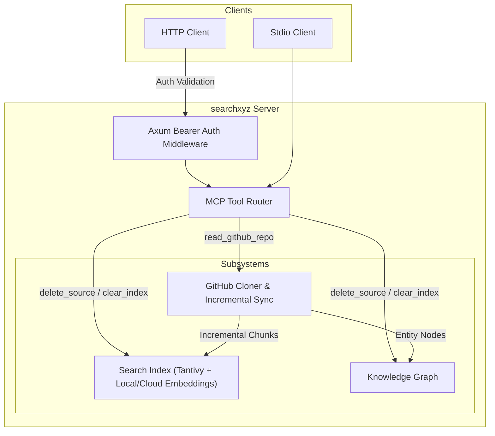

# Technical Design Specification: searchxyz Enhancements

> **Date:** 2026-06-21  
> **Status:** Draft  
> **Topic:** Chunking, DB Maintenance, Custom Embeddings, HTTP Auth, and Incremental Git Ingestions

---

## 1. System Components & Overview

We will introduce five key enhancements to the `searchxyz` codebase to optimize AI agent research precision, maintainability, scalability, and network security.



---

## 2. Feature Specifications

### 2.1 Feature A: Markdown-Aware Chunking & Document Splitting
Currently, documents are indexed as a single block, causing token limits to truncate embeddings (standard models limit input to 512 tokens).

* **Design**:
  * Implement `Chunker` logic in `src/extractor/mod.rs` or `src/index/mod.rs`.
  * **Markdown-Aware split**: Parse markdown content line-by-line. Split whenever heading levels `#`, `##`, `###` are encountered, grouping content between headers.
  * **Sliding Window Fallback**: If a heading section is longer than `1500` characters, or if no headers are found in the document, chunk using a character sliding window of size `1500` with an overlap of `200` characters.
  * **Naming / Schema Identification**: 
    * The parent URL is stored as `base_url`.
    * Chunks are stored in the index with the URL identifier format: `base_url#chunk-N` (where `N` is 0-indexed).
    * When retrieving search results, scores are evaluated per chunk, ensuring high precision retrieval of targeted sections.

### 2.2 Feature B: DB Maintenance & Pruning Tools
AI agents need to maintain their databases dynamically.

* **Design**:
  * Add a deletion method in `SearchIndex` (`src/index/mod.rs`):
    ```rust
    pub async fn delete_document(&self, url: &str) -> Result<(), SearchXyzError>
    ```
    * This runs `writer.delete_term(Term::from_field_text(self.f_url, url))` to delete the parent document.
    * It also constructs a `PrefixQuery` for `url#` and runs `writer.delete_query(&PrefixQuery::new(Term::from_field_text(self.f_url, &format!("{}#", url))))` to delete all associated chunks.
    * Commits the writer immediately.
  * Add pruning logic in `KnowledgeGraph` (`src/graph/mod.rs`):
    * `prune_node(&mut self, name: &str)`: Removes the node matching `name` case-insensitively, and removes all edges where `source == name` or `target == name`.
    * `clear(&mut self)`: Clears nodes map and edges vector.
  * Add new MCP tools in `src/tools/mod.rs`:
    * `delete_source(url: String)`: Wipes the index documents/chunks matching `url` and prunes the node from the graph.
    * `clear_index()`: Wipes the entire database index and knowledge graph.

### 2.3 Feature C: Model Customization for Embeddings
Allows customization of embedding generation, supporting local ONNX models via `fastembed` or external cloud API providers.

* **Design**:
  * Introduce configuration schemas in `src/config/mod.rs`:
    ```rust
    #[derive(Deserialize, Clone, Debug)]
    pub struct EmbeddingConfig {
        pub provider: String,      // "local", "openai", "gemini", "cohere"
        pub model: String,         // model name
        pub api_key: Option<String>,
    }
    ```
  * In `src/index/mod.rs`, instead of locking only `fastembed::TextEmbedding`, implement an abstract `EmbeddingGenerator` trait or enum:
    ```rust
    pub enum EmbeddingGenerator {
        Local(TextEmbedding),
        OpenAi { client: reqwest::Client, model: String, api_key: String },
        Gemini { client: reqwest::Client, model: String, api_key: String },
        Cohere { client: reqwest::Client, model: String, api_key: String },
    }
    ```
  * On `add_document`, invoke the correct variant to generate 1536-dimensional (OpenAI) or 384-dimensional (local) embeddings.
  * Adjust Tantivy schema search matching: query vectors must dynamically match the dimensions of the model.

### 2.4 Feature D: Authentication & Encryption for SSE Remote Server
Enforce authentication on the HTTP/SSE endpoints.

* **Design**:
  * Read the pre-shared auth token from `searchxyz.toml` or `SEARCHXYZ_API_KEY` env variable.
  * Implement an Axum middleware function `auth_middleware` in `src/main.rs`:
    * If `auth_token` configuration is set, verify the `Authorization` header.
    * Mismatched or missing bearer tokens result in `StatusCode::UNAUTHORIZED` (401).

### 2.5 Feature E: Incremental Git Ingestions
Allows updating repositories incrementally instead of cloning them from scratch.

* **Design**:
  * In `src/crawler/github.rs`, target directory is set inside `~/.searchxyz/repos/<repo_name_hash>`.
  * If the directory already exists:
    1. Run `git fetch --depth 1` and `git reset --hard origin/<branch>`.
    2. Extract file modifications: `git diff --name-only HEAD@{1} HEAD`.
    3. For deleted or modified files:
       * Delete their chunks from the Tantivy index (by formatting the file URL path).
    4. For added or modified files:
       * Read files, split them using the markdown-aware chunking pipeline, and index them.
  * If the directory doesn't exist, perform a clean checkout and index all files.

---

## 3. Implementation Phases

1. **Phase 1**: Implement markdown-aware chunking and Tantivy prefix deletions.
2. **Phase 2**: Create Graph pruning methods (`prune_node`, `clear`) and register `delete_source` and `clear_index` MCP tools.
3. **Phase 3**: Implement dynamic embedding provider config (Local ONNX + OpenAI/Gemini/Cohere cloud integrations).
4. **Phase 4**: Add Axum Bearer Token middleware for HTTP/SSE endpoint protection.
5. **Phase 5**: Refactor GitHub crawler to run git pull/fetch, compute git diffs, and perform incremental index/graph syncs.
6. **Phase 6**: Update changelog, verify compilation, format code, and execute tests.
